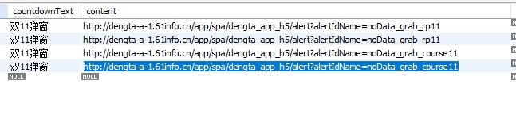

# 2019-11-13

## TaskList
-[X] 首页接口优化
-[X] 需求评审商城主页优化V4
-[ ] 金刚区排行榜的统计问题。
-[ ] APP发版流程文档编写。

### 首页接口优化
优化接口时发现重载方法的“滥用”，以及底层方法进行数据库查询的问题。
实体类中的方法应该禁用数据库查询的操作。
交付测试时，可以明确告知修改影响的功能和区域做重点关注。

### 问题
配置数据库中存在包含主域名的字段。容易在上线时忘记为正式环境的域名。

做一些定时功能时，应该在相应的时间节点，检查一下线上的运行情况，防止出现问题而不知情。