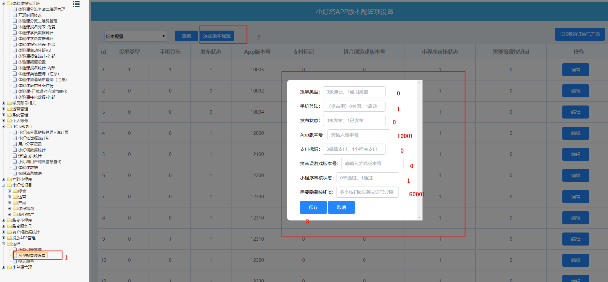

# APP发版流程文档

## 1.后端功能优先发版
   后端功能发版后-》检查线上旧版本兼容性问题。
   > 在后端发版后，就可以在APP发版前先检查旧版本的兼容问题。
## 2.IOS提审相关
1. IOS 上线流程详见：App Store 上线检查清单.pdf
2. 审核相关配置

### 2.1 审核相关配置


    库：i61_config
        表：configData
            说明：订单、优惠券模块
                CName = DENGTA_APP_IOS_SHOW_ORDER_KEY（是否展示IOS订单、优惠券模块）
                CValue = 0 (0不展示 1展示)
                接口/dengta/app/userInfo.json 的 showDetail 字段返回
    库：i61_service
        表：dengta_app_config
                phoneLogin 三期之前用来控制手机登录按钮的隐藏与显示，三期有了用户体系之后做了手机号登录功能；
                publishStatus 用来控制审核中还是审核后状态；(区别：审核中状态，会隐藏奖学金相关信息，审核后的会放出所有供用户使用的功能)
                miniprogramStatus 用来控制小程序的审核与发布状态；（需要对接微信小程序时使用，否则发布即可）
                hideBtnIds 字段用来控制奖学金模块的隐藏，有具体的参数配置(具体参数配置见dengta_app_btn_def表)。
                其他字段详情看表设计及注释...
> 说明：以上配置现都可在cms菜单“运维-APP配置项设置“处进行配置
> 配置时找到对应的版本设置对应的参数即可(相关参数说明cms都有)  


    IOS审核期间：
        投屏类型：0 乐博云
        手机登陆：1 启动
        发布状态： 0 未发布
        App版本号：请输入版本号
        支付标识：0 微信支付
        拼音课游戏版本号：  （默认）0 （请输入游戏版本号）
        小程序审核状态： （默认）1 通过（具体看应用小程序情况 默认设置通过）
        需要隐藏按钮id： 60001（目前只有这个）多个按钮id以英文逗号分隔
    IOS审核通过：
        投屏类型：0 乐博云
        手机登陆：1 启动
        发布状态： 1 发布（修改为发布）
        App版本号：请输入版本号
        支付标识：0 微信支付
        拼音课游戏版本号：  （默认）0 （请输入游戏版本号）
        小程序审核状态： （默认）1 通过（具体看应用小程序情况 默认设置通过）
        需要隐藏按钮id： 0  （修改为0）

 
### 2.2 表信息
```sql
CREATE TABLE `dengta_app_config` (
	`id` INT(10) UNSIGNED NOT NULL AUTO_INCREMENT,
	`castVideoType` INT(10) NOT NULL DEFAULT '0' COMMENT '投屏类型 0乐播云 1 通用类型',
	`phoneLogin` INT(10) NOT NULL DEFAULT '0' COMMENT '1(IOS端开启手机登陆) 0关闭',
	`publishStatus` TINYINT(4) NOT NULL DEFAULT '0' COMMENT '0 未发布，1已发布',
	`payFlag` TINYINT(1) NULL DEFAULT '0' COMMENT '微信支付或者通过小程序支付标志位 0-微信支付 1-通过小程序支付',
	`gameVersion` TINYINT(1) NULL DEFAULT '0' COMMENT '拼音课游戏版本',
	`appVersionCode` VARCHAR(11) NOT NULL DEFAULT '' COMMENT '版本号',
	`miniprogramStatus` TINYINT(1) NOT NULL DEFAULT '0' COMMENT '小程序审核状态 0未过审，1已过审',
	`hideBtnIds` VARCHAR(50) NOT NULL DEFAULT '0' COMMENT '需要隐藏按钮id（60001 个人中心-奖学金模块）',
	PRIMARY KEY (`id`)
)
COMMENT='应用配置表'
COLLATE='utf8mb4_general_ci'
ENGINE=InnoDB
ROW_FORMAT=DYNAMIC
AUTO_INCREMENT=33
;

```
            
## 3.发布更新

### 3.1 安卓发布更新
> 安卓的更新是软件内更新。需要上传安装包到静态站点后执行更新sql
1. 打包压缩包上传到静态站点需解压到/home/web/static/service/apk目录下；
2. 检查路径是否可以正常下载： http://static2.61info.com/service/apk/包文件名.apk
3. 发布执行更新sql 
> publishPlatform 安装的发布平台为3（公司平台）

> isNeedForceUpdate 为1时强制所有版本更新到最新版

> isNeedNotifyUser  为1时提示所有用户更新到最新版
> downloadUrl  为应用内更新包的下载地址，即前面上传得到的静态资源地址。
> publishTime 发布时间
> clientType  android
```sql
INSERT INTO `dengta_app_publish` (`id`,`platform`,`clientType`,`version`,`code`,`publishPlatform`,`publishTime`,`publishContent`,`publishTitle`,`isNeedForceUpdate`,`isCurrentLastest`,`isNeedNotifyUser`,`packageSize`,`downloadUrl`,`qrCodeUrl`,`insertTime`,`updateTime`)
 VALUES (166,'phone','android','1.5.2',0000010024,3,'2019-11-08 19:20:12','1、新增双十一红包雨活动；\r\n2、双十一买5送3，限时抢购；','双十一优惠活动火热进行',0,1,1,15.00,'http://static2.61info.com/service/apk/app-release-jiagu-release-152.apk','http://static2.61info.com/service/apk/app-release-jiagu-release-152.apk','2019-11-08 19:20:53','2019-11-08 19:41:39');
```
### 3.2 IOS发布更新
1. 发布执行更新sql 
> publishPlatform 安装的发布平台为1（appStore）
> clientType  ios
> downloadUrl  填写IOS调整AppleStore的链接。
```sql
INSERT INTO `i61_service`.`dengta_app_publish` (`platform`, `clientType`, `version`, `code`, `publishPlatform`, `publishTime`, `publishContent`, `publishTitle`, `isNeedForceUpdate`, `isCurrentLastest`, `isNeedNotifyUser`, `packageSize`, `downloadUrl` )
 VALUES ('phone', 'ios	', '1.5.0', '0000015000', '1', '2019-11-01 11:42:02', '1.5.0版本更新', '1.5.0版本更新', '0', '1', '1', '15.00', 'itms-apps://itunes.apple.com/app/id1458106216?mt=8');
```

### 3.3 表结构
```sql
CREATE TABLE `dengta_app_publish` (
  `id` int(10) unsigned NOT NULL AUTO_INCREMENT,
  `platform` varchar(64) NOT NULL COMMENT 'phone或则windows',
  `clientType` varchar(64) NOT NULL COMMENT '类型、ios、android、windows',
  `version` varchar(255) NOT NULL COMMENT '版本名称',
  `code` int(10) unsigned zerofill NOT NULL DEFAULT '0000000000' COMMENT '版本号',
  `publishPlatform` int(11) NOT NULL DEFAULT '0' COMMENT '发布平台平台、根据clienttype（android和window下:0默认平台/2蒲公英/3.公司平台）（ios下:1.appStore/2.蒲公英/3.公司平台）',
  `publishTime` datetime NOT NULL COMMENT '发布时间',
  `publishContent` varchar(2000) DEFAULT NULL COMMENT '发布内容',
  `publishTitle` varchar(100) DEFAULT NULL COMMENT '发布标题',
  `isNeedForceUpdate` tinyint(3) unsigned NOT NULL COMMENT '是否需要强制更新(1开0关)',
  `isCurrentLastest` tinyint(3) unsigned NOT NULL COMMENT '是否是当前最新版本（1开0关)',
  `isNeedNotifyUser` tinyint(3) unsigned NOT NULL COMMENT '是否需要提示用户（1开0关)',
  `packageSize` decimal(6,2) NOT NULL DEFAULT '0.00' COMMENT '安装包大小',
  `downloadUrl` varchar(1024) DEFAULT NULL COMMENT '下载链接',
  `qrCodeUrl` varchar(1024) DEFAULT NULL COMMENT '二维码地址',
  `insertTime` datetime NOT NULL DEFAULT CURRENT_TIMESTAMP COMMENT '创建时间',
  `updateTime` datetime NOT NULL DEFAULT CURRENT_TIMESTAMP ON UPDATE CURRENT_TIMESTAMP COMMENT '更新时间',
  PRIMARY KEY (`id`)
) ENGINE=InnoDB AUTO_INCREMENT=167 DEFAULT CHARSET=utf8mb4 ROW_FORMAT=DYNAMIC COMMENT='应用发布表'
```


## 其他APP相关的配置

    说明：课程黑名单，配置的课程不在首页课程列表显示
        CName = DENGTA_APP_BLACK_COURSE_ID_LIST
        CValue = 10,11,4,5 （课程ID,课程ID,课程ID）
    说明：我的课页 黑名单，配置的课程不在我的课页 显示
        CName = DENGTA_APP_BLACK_MY_COURSE_ID_LIST
        CValue =  （课程ID,课程ID,课程ID）